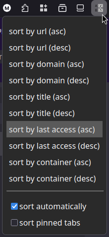

# Sort tabs advanced

https://addons.mozilla.org/firefox/addon/sort-tabs-advanced/

Web extension for sorting tabs by various criteria:

* url
* domain
* title
* last time of access
* container

I found myself frustrated that it's not possible to sort tabs by domain in Firefox 57.

Then, I discovered that sorting tabs by access time is kinda useful.
You can push the tabs you use often to the top, sinking old ones saved for later.

There are switches in the popup that allow toggling automatic sorting and pinned tab sorting.

## Automatic sorting

The last sorting method that you selected gets remembered in settings.

If automatic sorting is enabled, this sorting method will be applied every time you change tabs (create new, change url, etc.).

Automatic sorting is preserved between browser restarts.

## Tab groups

The addon preserves tab groups.

"Islands" of tab groups, surrounded by ungrouped tabs, are preserved. The ungrouped tabs before and after the group are sorted separately.

## Building the extension

Run `build.sh`, which uses `web-ext`.
